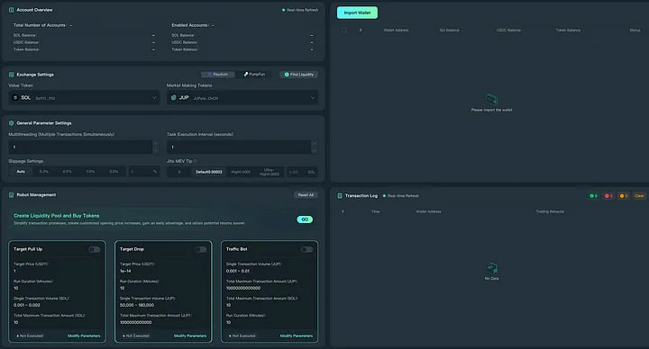

PumpTrader Bot is a tool for managing trading strategies, liquidity and monitoring tokens on the Solana blockchain. 

This bot is designed for token creators, liquidity pools and traders, providing a user-friendly interface for automating trading operations via Telegram.

(The bot is available on macOS and windows)

## For full access contact me on telegram: https://t.me/ZeronodeX

I provide full access to the bot and also provide an introduction to using the program. 
Always in touch

## Key features

# Creation of "Pump" orders

# Market-making(AMM)

# Antidamp protection

# Create and manage wallets:

- Automatic creation of Solana wallets from main wallet.

- Manage your balance and transactions with a command in Telegram.

- Support for multiple wallets for different tasks.

   Bot wallets provide the following functionality:

       Creating wallets for transactions:

          Each wallet gets its own private and public key.
          Wallets can be used for token storage, liquidity transactions, or to participate in trading strategies.

       Wallet Management:

          Checking the balance for specified tokens.
          Transfer tokens between wallets.
          Setting up automatic transactions for strategies such as Pump or liquidity management.

       Liquidity integration:

         Using wallets to add liquidity to pools or to trade on DEX.

# Trading Operations:

- Placing pump orders to artificially increase the trading volume.

- Real-time monitoring of token prices.

- Integration with popular decentralized exchanges (DEX) on Solana.

# Liquidity management:

- Automatic addition of liquidity to pools on DEX.

- Balancing tokens in liquidity pools.

# Price monitoring:

- Ongoing price tracking and notification of significant changes.

- Setting up notifications via Telegram.

## RPCs and APIs used

# Solana RPC:

- Basic RPC: https://lb.drpc.org/ogrpc?network=solana&dkey=Arc_JqtwaUlmmje2rvgtJWyamxyDxxAR77DXIlZWwHzR (or other custom RPC just add from settings).
Used for blockchain data, including token balances, transaction creation, and interaction with Solana programs.

# API for price monitoring:

- [CoinGecko API](https://www.coingecko.com/): To get current token prices.

- [Serum DEX API](https://projectserum.com/): To get order stack data and interact with the exchange.

# DEX Integration:

- Raydium: For transactions with liquidity pools and token exchanges.

- Orca: For token trading and liquidity management.

- Jupiter Aggregator: To find the best prices among DEX.

- Serum: For direct interaction with order stacks.

## How the bot uses DEX

# Raydium:

- Adding or withdrawing liquidity from pools.

- Token trading through automated market makers (AMM).

# Orca:

- Simple and fast token trading.

- Optimized transactions for low volumes.

# Serum:

- Token trading via order stacks.

- Ideal for strategies that require direct price control.

# Jupiter:

- Price aggregation and transaction routing to minimize slippage.

- Conveniently choose the best path for token exchange.

## Function implementation for PumpTrader Bot

# 1. Creation of "Pump" orders
This feature automatically places token buy/sell orders to create visibility of activity on Pumpfun.

Buying tokens in small batches.

The frequency is set by the user.

How it works?
User input:

- Token: the address of the token on Solana.

- Quantity: total number of tokens to be bought/sold.

- Breakdown: the size of batches (for example, 10 purchases of 100 tokens each).

- Time between orders: interval in seconds.

- The bot is connected to DEX (e.g. Raydium) via RPC.

Algorithm:

- Checks the availability of liquidity in the pool.

- Places a buy order.

- Waits for a specified interval, repeats the process.

- Notifies of completion via Telegram or log file.

# 2. Market-making(AMM)
The bot maintains a narrow spread between buying and selling a token to increase liquidity and improve market behavior.

How it works?
User input:

- Token.

- Minimum spread (e.g. 1%).

- Maximum trading volume for one cycle.

Algorithm:

- Analyzes the current price in the pool.

- Places buy and sell orders taking into account the specified spread.

- Monitors the execution of orders and corrects them.

Notices:
- The bot sends reports on liquidity maintenance.
- Logs price and spread changes.

# 3. Antidamp protection
This feature protects the token from a sharp drop in price by automatically placing protective orders.

How it works?
The user enters:

- Token.

- Minimum price.

- Number of tokens to protect.

Algorithm:

- Continuously monitors the price of the token on DEX.

- If the price falls below the minimum level:
Automatically places a large buy order to stabilize the price.

Notices:
If the antidump feature is triggered, the bot sends a notification to Telegram.

# 4. Liquidity management
The bot allows you to automate the addition and withdrawal of liquidity from pools on DEX (e.g. Raydium, Orca).

How it works?
The user enters:

- Token A and B: addresses of tokens in the pool.

- Target balance: the number of tokens to be maintained in the pool.

- Minimum reserve: limit for liquidity withdrawal.

Algorithm:

- Checks the current balance of tokens in the pool.

- If there are not enough tokens, adds liquidity.

- If there are too many tokens, withdraws some liquidity.

Notices: 
Sends reports when there are significant changes in liquidity.

# 5. Mass transactions (drops)
The feature allows mass distribution of tokens (airdrops) to users.

How it works?
The user uploads a CSV file with recipient addresses and number of tokens.

Algorithm:

- Checks if there are enough tokens on the wallet.

- Splits transactions into batches to bypass network limits.

- Signs and sends each transaction.

Logs:
Saves the results to a file (successful and unsuccessful sends).

Notices:
Sends the final report to Telegram.

# 6. Market monitoring
The feature collects token data from Pumpfun and DEX to help the user keep track of market dynamics.

How does it work?
The bot connects to the Pumpfun and DEX APIs via RPC.

           It collects data:

                -Price, trading volume, liquidity.
                -Comparison with competitors.

        Notifications:

               -Sends pump/dump alerts.
               -Indicates key changes in the market.

Conclusion:

Data is displayed in a graphical interface.

# 7. Integration with Telegram
The bot sends notifications and accepts commands via Telegram.

How does it work?
The user connects the bot to Telegram by entering the bot token.

Notices:

Important events (e.g., price drop, drop completion).

Teams:

 '/status' — bot state.

 '/pause' — temporarily stopping all tasks.

 '/resume' — continued employment.

 '/report' — a report on the bot's actions.

# 8. Setting up scenarios
The feature allows you to automate actions such as running pamp, creating liquidity or drops on a schedule.

How it works?
The user creates a scenario:

- Selects actions (e.g. “add liquidity”).

- Specifies parameters and schedule.

Algorithm:

- Executes the script at the specified time.
- Monitors successful execution.

Notifications:

Sends a report of each scenario execution.

## How to connect a bot to Telegram

# 1. Get a token for your bot

Open the Telegram app.

Find the BotFather bot (type @BotFather in the Telegram search box).

Send the '/start' command to start the interaction.

Create a new bot using the command '/newbot.'

Enter a name for the bot (e.g. PumpTraderBot).

Enter a unique username for the bot ending in bot (e.g. PumpTrader_PumpBot).

BotFather will generate an API token (for example: 123456:ABC-DEF1234ghIkl-zyx57W2v1u123ew11).

Save this token, you will need it for customization.

# 2. Configure the token in your code

Open the 'config.json' file in your bot's code directory.

Make sure it contains the following format:

'{
    "telegram_token": "YOUR_TOKEN_FROM_BOTFATHER",
    "solana_rpc_url": "https://api.mainnet-beta.solana.com" 
}'

Replace 'YOUR_TOKEN_FROM_BOTFATHER' with the token provided by BotFather.

If you have your own RPC URL for Solana, replace https://api.mainnet-beta.solana.com.

# 3. Start the bot

Make sure you have Python version 3.8 or higher installed.

Install the necessary libraries:

'pip install py-solana pyTelegramBotAPI'

Run the script:

'python your_bot_file.py'

Make sure that 'your_bot_file.py' replaced by the name of the bot code file.

# 4. Check the bot's performance

In Telegram, search for your bot by username (e.g. @PumpTrader_PumpBot).

Send the command '/start'

Check the available commands with '/help'.
